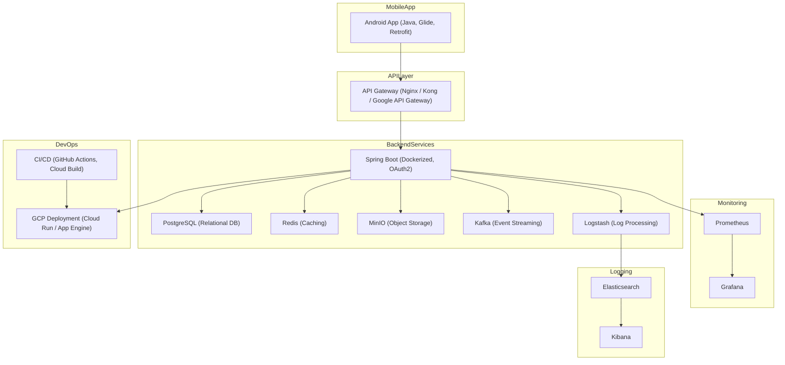

# 🎵 Spotify Clone App

A full-featured Spotify-like music streaming application for Android, built with Java and Spring Boot. The app allows users to upload, stream, and manage music with a backend powered by modern microservice architecture and cloud-native technologies.

## 📊 Features

- User authentication with OAuth2 (Google/Facebook login)
- Upload, stream, and play music from MinIO storage
- Playlist creation and management
- Real-time event processing via Kafka
- Redis-based caching for fast response
- Centralized logging with ELK stack (Elasticsearch, Logstash, Kibana)
- Monitoring with Prometheus and Grafana
- CI/CD integration with GitHub Actions and Google Cloud Build
- Deployable via Docker to GCP Cloud Run or App Engine

## ⚙️ Tech Stack

### Frontend (Mobile)
- Java (Android Studio)
- Glide, Retrofit, ExoPlayer

### Backend
- Java Spring Boot
- Spring Security + OAuth2
- PostgreSQL (relational database)
- Redis (caching)
- Apache Kafka (event streaming)
- MinIO (object storage)
- Dockerized microservices

### Observability
- Prometheus + Grafana (metrics and monitoring)
- ELK Stack (centralized logging)

### DevOps
- Docker
- GitHub Actions + Google Cloud Build (CI/CD)
- GCP (Cloud Run / App Engine)

## 🌐 Architecture Overview



## 📖 Getting Started

1. **Clone the repository**
```bash
git clone https://github.com/yourusername/spotify-clone.git
```

2. **Set up Android Project**
- Open `android/` in Android Studio
- Run on emulator or physical device

3. **Set up Backend**
```bash
cd backend/
docker-compose up --build
```

4. **Configure `.env` or `application.yml`**
- Add keys for database, Kafka, MinIO, OAuth providers

## 🚀 Deployment
- CI/CD pipelines already configured for GCP
- To deploy manually:
```bash
gcloud run deploy spotify-backend --source . --region=us-central1
```

## 🙏 Contributing
Pull requests and issues are welcome. For major changes, please open an issue first to discuss what you would like to change.

## ✅ License
This project is licensed under the MIT License.
