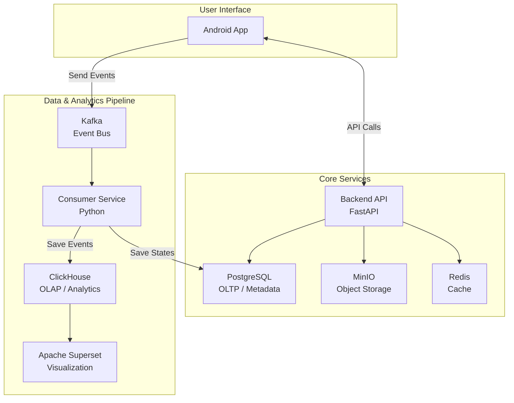

# Spotify Clone (AI-Powered Music Experience)

Một dự án mã nguồn mở nhằm xây dựng một ứng dụng nghe nhạc tương tự Spotify, tập trung vào trải nghiệm cá nhân hóa mạnh mẽ thông qua hệ thống gợi ý AI/ML và kiến trúc hướng sự kiện (event-driven) hiện đại.

## 📖 Mục Lục

- [Giới Thiệu](#giới-thiệu)
- [Tính Năng Chính](#tính-năng-chính)
- [Kiến Trúc Hệ Thống](#kiến-trúc-hệ-thống)
- [Ngăn Xếp Công Nghệ](#ngăn-xếp-công-nghệ)
- [Thiết Lập Môi Trường Local](#thiết-lập-môi-trường-local)
- [Kế Hoạch Dự Án](#kế-hoạch-dự-án)

## 🎯 Giới Thiệu

Dự án này không chỉ là một trình phát nhạc đơn thuần. Mục tiêu cốt lõi là xây dựng một hệ sinh thái hoàn chỉnh, nơi mỗi tương tác của người dùng (từ một cú click, một lượt nghe, một lượt "thích") đều được ghi nhận và phân tích theo thời gian thực để tạo ra một trải nghiệm âm nhạc độc đáo và ngày càng thông minh hơn cho chính người dùng đó.

Hệ thống được thiết kế từ đầu với khả năng mở rộng, tách biệt các thành phần và xử lý dữ liệu lớn, mô phỏng theo kiến trúc của các ứng dụng hiện đại.

## ✨ Tính Năng Chính

### 🔧 Nhóm Cốt lõi (MVP)

- **Xác thực người dùng**: Đăng ký, đăng nhập an toàn.
- **Phát nhạc**: Stream nhạc chất lượng cao từ kho lưu trữ riêng (MinIO).
- **Quản lý Thư viện**: Tạo/sửa/xóa playlist, quản lý danh sách bài hát yêu thích.
- **Tìm kiếm**: Tìm kiếm cơ bản theo tên bài hát, nghệ sĩ, album.

### 🤖 Nhóm AI/ML & Cá nhân hóa

- **Hệ thống gợi ý đa dạng**:
  - **Content-Based**: Gợi ý các bài hát tương tự bài đang nghe ("Đài phát thanh").
  - **Collaborative Filtering**: Gợi ý dựa trên hành vi của những người dùng có cùng sở thích ("Dành riêng cho bạn").
- **Playlist thông minh**: Tự động tạo playlist theo tâm trạng, thể loại dựa trên phân tích đặc trưng âm thanh.
- **Phân tích âm thanh**: Tự động trích xuất các thuộc tính của bài hát (tempo, energy, danceability...) bằng librosa.

### 👥 Nhóm Trải Nghiệm & Xã Hội (Mới)

- **Hồ Sơ Người Dùng Công Khai (Public User Profiles)**: Cho phép người dùng xem trang cá nhân của người khác, bao gồm các playlist công khai và hoạt động gần đây.
- **Lời Bài Hát Thời Gian Thực (Real-time Lyrics)**: Hiển thị và đồng bộ lời bài hát với nhạc đang phát, mang lại trải nghiệm tương tác cao hơn.

### 📊 Nhóm Analytics & Dữ liệu

- **Thu thập sự kiện thời gian thực**: Ghi nhận mọi tương tác của người dùng qua Kafka.
- **Dashboard trực quan**: Xây dựng các bảng xếp hạng, biểu đồ thống kê lượt nghe, tỷ lệ bỏ qua... bằng Apache Superset.

## 🏗️ Kiến Trúc Hệ Thống

Dự án được xây dựng dựa trên kiến trúc **Microservices** và **Hướng sự kiện (Event-Driven)**. Kafka đóng vai trò là "hệ thần kinh trung ương", giúp các thành phần giao tiếp với nhau một cách bất đồng bộ và tách rời.



### 🔄 Luồng hoạt động chính:

1. **Người dùng tương tác** trên Android App.
2. **App gửi các sự kiện** (nghe, thích, click) đến Kafka và gọi Backend API để lấy dữ liệu hiển thị.
3. **Backend API** truy vấn PostgreSQL (lấy metadata), Redis (lấy cache), và chạy mô hình AI để trả về kết quả. File nhạc được phục vụ từ MinIO.
4. **Consumer** lắng nghe sự kiện từ Kafka, xử lý và ghi dữ liệu vào ClickHouse (cho analytics) và PostgreSQL (cập nhật trạng thái).
5. **Apache Superset** kết nối vào ClickHouse để tạo các dashboard phân tích.

## ⚙️ Ngăn Xếp Công Nghệ

| **Lĩnh vực**         | **Công nghệ**                 | **Vai trò**                                        |
| -------------------- | ----------------------------- | -------------------------------------------------- |
| **Frontend**         | Android Native (Java/Kotlin)  | Giao diện người dùng trên di động.                 |
| **Backend API**      | Python (FastAPI)              | Cung cấp RESTful API, chạy mô hình AI.             |
| **Hệ thống Sự kiện** | Apache Kafka                  | "Hệ thần kinh" tiếp nhận và phân phối sự kiện.     |
| **CSDL Giao dịch**   | PostgreSQL                    | Lưu trữ siêu dữ liệu mô tả và trạng thái ứng dụng. |
| **CSDL Phân tích**   | ClickHouse                    | Lưu trữ và truy vấn dữ liệu sự kiện để phân tích.  |
| **Lưu trữ File**     | MinIO                         | Kho lưu trữ các file media (nhạc, ảnh).            |
| **Caching**          | Redis                         | Cache dữ liệu và kết quả AI để tăng tốc độ.        |
| **Trực quan hóa**    | Apache Superset               | Tạo biểu đồ, dashboard phân tích.                  |
| **Triển khai**       | Docker & Docker Compose       | Đóng gói và quản lý toàn bộ services.              |
| **AI/ML**            | Scikit-learn, Pandas, Librosa | Xây dựng và huấn luyện mô hình gợi ý.              |

## �� Thiết Lập Môi Trường Local

### 📋 Yêu cầu

- Git
- Docker và Docker Compose

### 🔧 Các bước thực hiện

1. **Clone repository:**

```bash
git clone https://your-repository-url.git
cd project-spotify-clone
```

2. **Chỉnh sửa các file cấu hình (nếu cần):**

   - Mở các file `.env` (nếu có) và tùy chỉnh các biến môi trường như port, thông tin đăng nhập database...

3. **Khởi chạy toàn bộ hệ thống:**
   - Chạy lệnh sau từ thư mục gốc của dự án. Docker Compose sẽ tự động tải các images cần thiết và khởi tạo tất cả các services (PostgreSQL, Kafka, ClickHouse...).

```bash
docker-compose up -d
```

4. **Kiểm tra trạng thái:**
   - Kiểm tra xem tất cả các container đã khởi chạy thành công hay chưa:

```bash
docker-compose ps
```

5. **Khởi chạy ứng dụng Android:**
   - Mở project Android bằng Android Studio và chạy trên máy ảo hoặc thiết bị thật. Đảm bảo ứng dụng có thể kết nối đến địa chỉ của backend API.

## 📅 Kế Hoạch Dự Án

Dự án được lên kế hoạch phát triển chi tiết trong **20 tuần**, chia thành các giai đoạn rõ ràng từ việc xây dựng nền tảng, hoàn thiện MVP, đến tích hợp AI và Analytics. Vui lòng tham khảo file kế hoạch chi tiết hoặc ứng dụng web quản lý kế hoạch để theo dõi tiến độ.

---

## 🤝 Đóng góp

Chúng tôi hoan nghênh mọi đóng góp từ cộng đồng! Vui lòng tạo Pull Request hoặc mở Issue để thảo luận về các tính năng mới.

## 📄 Giấy phép

Dự án này được phát hành dưới giấy phép MIT License.
